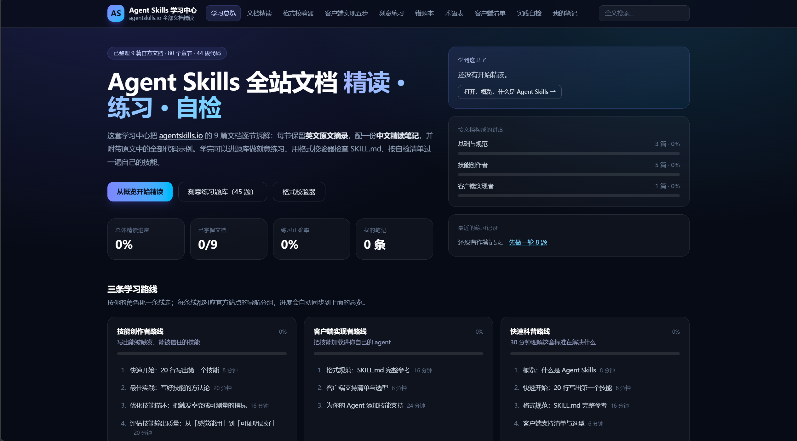

# Agent Skills 学习中心

把 [agentskills.io](https://agentskills.io) 全部 9 篇官方文档整理成**可精读、可练习、可自检**的中文学习平台：每节保留英文原文摘录 + 中文精读笔记 + 原文代码示例，并内建题库、错题本、格式校验器与实践自检清单。

> Agent Skills 是 Anthropic 发起、现为开放标准的「用文件夹 + `SKILL.md` 给 AI Agent 扩展能力」的规范。本项目面向中文学习者，把这套规范从「读文档」升级为「学 - 练 - 测 - 追踪」的闭环。



## 功能

- **文档精读**：9 篇官方文档逐节拆解，中英对照、代码块可复制、小节勾选进度、断点续读（`/docs`）
- **刻意练习**：约 75 道选择题，按文档或全站混合出题，答完即时判分与解析，记录历史成绩（`/quiz`）
- **错题本**：自动汇总答错过的题目，按错误次数加权出题重练（`/review`）
- **格式校验器**：在浏览器里校验 `SKILL.md` frontmatter 是否符合规范（`/spec`）
- **客户端实现五步**：给 Agent 产品加 Skills 支持的生命周期拆解，含目标与常见坑（`/lifecycle`）
- **术语表 / 客户端清单 / 实践自检清单**（`/glossary`、`/clients`、`/checklist`）
- **全文搜索**：跨章节、代码、术语、客户端四类内容检索（`/search`）
- **学习笔记**：按文档记录自由笔记（`/notes`）
- **学习总览**：总体进度、正确率、按文档构成的可视化看板（`/`）

## 技术栈

| 层 | 技术 |
|---|---|
| 框架 | Next.js 16（App Router）+ React 19 + TypeScript |
| 样式 | Tailwind CSS 4 |
| 内容 | 官方文档整理为结构化静态数据，存于 `src/data/`，构建期直接渲染 |
| 状态 | 阅读进度 / 笔记 / 测验记录保存在浏览器 localStorage，无需数据库与账号 |

> 架构说明：本项目**没有数据库**。学习内容全部是静态数据；个人学习状态属于单个访客，存在本机浏览器里最合适——这也让部署变成零配置，且每位访客的数据彼此独立。

## 快速开始

### 前置条件（唯一的依赖）

- **Node.js 20 或更高**（开发使用 v22），下载地址 <https://nodejs.org>

仅此而已。本项目不需要数据库、不需要环境变量，也**没有** Python 那种 `requirements.txt`——Node 项目的依赖清单就是仓库里的 `package.json`，脚本会自动按它安装全部依赖。

### 方式一：一键脚本（推荐）

克隆仓库后直接双击（脚本会自动完成装依赖 → 构建 → 启动 → 打开浏览器）：

| 系统 | 启动 | 停止 |
|---|---|---|
| Windows | 双击 `启动.bat` | 双击 `停止.bat`（或直接关掉启动窗口） |
| macOS / Linux | `./启动.sh`（首次需 `chmod +x 启动.sh`） | `./停止.sh`（或按 `Ctrl + C`） |

首次运行会自动 `npm install`（约 1 分钟）并构建生产版本；之后每次启动只需几秒。脚本基于自身所在目录定位（`%~dp0`），把仓库放在任何路径都能用。

### 方式二：命令行

```bash
# 1. 安装依赖（仅首次）
npm install

# 2. 启动开发服务器（改代码热更新）
npm run dev
# 或：生产模式（更接近线上效果）
npm run build && npm start
```

打开 <http://localhost:3000> 即可。学习进度、笔记、测验成绩会自动保存在浏览器本地。

### 常用脚本

| 命令 | 作用 |
|---|---|
| `npm run dev` | 启动开发服务器（改代码热更新） |
| `npm run build` | 生产构建，静态导出到 `out/` 目录 |
| `npm start` | 本地预览 `out/`（http://localhost:3000） |
| `npm run lint` / `npm run typecheck` | 代码检查 / 类型检查 |

## 内容更新流程

文档内容集中在 `src/data/*.ts`（`docs-foundations` / `docs-authoring-a` / `docs-authoring-b` / `docs-implementation` 四组），题库与术语在 `src/data/study.ts`，规范字段与清单在 `src/data/reference.ts`。

更新内容只需：编辑对应 `src/data/*.ts` 文件，然后重新构建部署。内容变更**不会影响**访客已保存的学习进度、笔记和测验成绩（它们在各自浏览器的 localStorage 里）。

## 目录结构

```
src/
├── app/                 # 路由与页面（App Router）
│   ├── page.tsx         # 学习总览看板
│   ├── docs/            # 文档精读（列表 + 详情）
│   ├── quiz/ review/    # 刻意练习 / 错题本
│   ├── spec/ lifecycle/ glossary/ clients/ checklist/ notes/ search/
│   ├── loading.tsx error.tsx not-found.tsx
├── components/          # DocReader / QuizRunner / SpecValidator / TopNav 等
├── data/                # 全部学习内容（结构化静态数据）
└── lib/                 # content.ts（静态内容访问） / store.ts（localStorage 学习状态）
```

## 二次开发指南

| 想改什么 | 改哪里 |
|---|---|
| 文案、标题、导航 | `src/components/TopNav.tsx`、各 `src/app/*/page.tsx` |
| 学习内容、题库、术语 | `src/data/*.ts`（改完重新构建即可） |
| 配色、圆角、字号 | 全局在 `src/app/globals.css` 与各组件 className；Tailwind 主题 token 见 `postcss.config.mjs` |
| 页面结构 / 路由 | `src/app/` 下对应目录 |
| 内容查询与搜索逻辑 | `src/lib/content.ts` |
| 进度 / 笔记 / 成绩的存储逻辑 | `src/lib/store.ts`（localStorage） |

## 部署

本项目通过 `output: "export"` 纯静态导出：`npm run build` 的产物 `out/` 目录只含 HTML/JS/CSS，**不依赖任何 Node 运行时**，可托管到任意静态平台（EdgeOne Pages、Cloudflare Pages、GitHub Pages、OSS/COS 桶、nginx……），平台迁移零成本。

以腾讯 EdgeOne Pages 为例（国内访问快、默认域名免备案）：控制台 → Pages → 导入 GitHub 仓库 → 构建命令 `npm run build`、输出目录 `out` → Deploy，之后每次 push 到 main 自动重新部署。自定义域名走国内节点需 ICP 备案，Demo 阶段用默认域名即可。

## 内容来源与许可

- 文档内容整理自 [agentskills.io](https://agentskills.io) 官方文档（原文许可 CC-BY-4.0），中文笔记与题库为本项目整理；
- 规范原文与参考实现见 GitHub 仓库 [agentskills/agentskills](https://github.com/agentskills/agentskills)；
- 本项目代码采用 MIT 许可。

## 免责声明

本项目为非官方中文学习工具，与 agentskills.io 官方无隶属关系。规范条文以官方原文为准。
